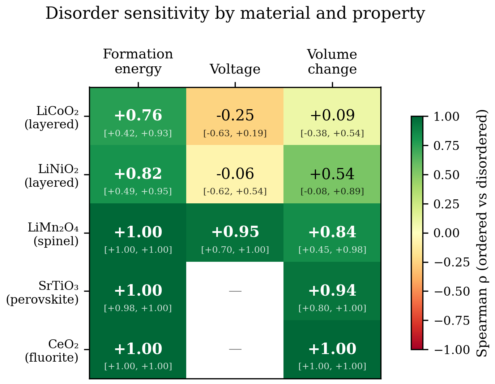

# Chemical Disorder Amplifies Screening Errors in Computational Dopant Selection for Layered Cathodes

**Authors:** Snehal Nair¹*

**Affiliations:** ¹ [TBD]

**Corresponding author:** * snehal@[TBD]

---

## Abstract

Computational dopant screening pipelines for battery cathodes universally assume ordered host structures — a single periodic arrangement of dopant atoms within the crystal lattice. Yet real synthesised materials exhibit chemical disorder, with dopant atoms statistically distributed across available sites. Here we quantify how this "disorder gap" affects dopant rankings by comparing ordered and disorder-aware (Special Quasi-random Structure) simulations using the MACE-MP-0 universal machine-learning interatomic potential across five oxide materials spanning three crystal structure types: layered (LiCoO₂, LiNiO₂), spinel (LiMn₂O₄), perovskite (SrTiO₃), and fluorite (CeO₂). We find that formation energy rankings are universally preserved (Spearman ρ = 0.76–1.00), but voltage rankings in layered cathodes lose all predictive power (ρ = −0.25 for LiCoO₂, ρ = −0.06 for LiNiO₂ — both statistically indistinguishable from zero). Critically, when applied to a sequential pruning pipeline — the dominant paradigm in computational screening — these ranking perturbations amplify catastrophically: ordered and disorder-aware pipelines share only 14% of their final candidates (Jaccard similarity). We validate our approach against published DFT data (20-dopant formation energy correlation ρ = 0.77; 4-dopant voltage ranking agreement) confirming that the disorder effect is physical, not a model artefact. Our results establish that voltage-based dopant selection in layered cathodes requires disorder-aware simulation, provide a quantitative test for when ordered screening is safe, and demonstrate that universal MLIPs make disorder-aware screening computationally tractable at approximately 1,000× lower cost than DFT.

---

## Introduction

The discovery of functional dopants for battery cathode materials has become a major target for computational screening. Layered oxides — LiCoO₂ (LCO), LiNi₀.₈Mn₀.₁Co₀.₁O₂ (NMC811), and their derivatives — dominate the lithium-ion battery market, and the selection of stabilising dopants directly determines cycle life, rate capability, and safety at high operating voltages¹⁻³. Recent studies have screened tens to hundreds of candidate dopants using density functional theory (DFT), typically employing sequential pruning pipelines that progressively filter candidates through formation energy, lattice strain, oxygen stability, and cation migration criteria⁴⁻⁶.

A common assumption underlies all such pipelines: the doped structure is modelled as an ordered supercell with a single, deterministic placement of dopant atoms. In a typical DFT screening study, one Co atom in a 2×2×1 supercell (48 atoms) is replaced by the candidate dopant, and properties are computed for this single configuration⁴. This ordered-host assumption is computationally convenient — it requires only one simulation per dopant — but it does not reflect the physical reality of synthesised materials, where dopant atoms occupy lattice sites with statistical disorder characteristic of a solid solution⁷⁻⁹.

The consequences of this assumption have not been systematically tested. While it is known that Special Quasi-random Structures (SQS)¹⁰ provide a more faithful representation of substitutional alloys, and that machine-learning interatomic potentials (MLIPs) such as MACE-MP-0¹¹ make large-supercell simulations affordable, no study has asked the critical question: **does accounting for chemical disorder change which dopants a screening pipeline selects?**

Here we answer this question systematically. We screen 20+ dopants across five oxide materials spanning three crystal structure types — layered (LiCoO₂, LiNiO₂), spinel (LiMn₂O₄), perovskite (SrTiO₃), and fluorite (CeO₂) — computing properties in both ordered supercells and ensembles of five SQS realisations using the MACE-MP-0 universal MLIP. We quantify ranking preservation using the Spearman rank correlation coefficient (ρ) between ordered and disordered predictions, and we simulate the propagation of ranking errors through a Yao-style sequential pruning pipeline⁴ to measure their practical impact on dopant selection.

Our central finding is that the disorder sensitivity of dopant rankings is **property-specific and structure-dependent**. Formation energy rankings are robust across all five materials (ρ ≥ 0.76), consistent with the local-bonding origin of substitution energetics. Voltage rankings in layered cathodes, however, are catastrophically disrupted (ρ ≤ −0.06), while remaining well-preserved in the spinel structure (ρ = 0.95). When these ranking perturbations propagate through a sequential pruning pipeline, the ordered and disorder-aware selections share only 14% of their final candidates — a finding with direct implications for the reliability of published dopant screening results.

---

## Results

### Disorder sensitivity is property-specific and structure-dependent

We computed formation energy, voltage, and volume change for each dopant in both ordered and SQS-disordered supercells across all five materials (Table 1, Fig. 1). The Spearman rank correlation coefficient (ρ) between ordered and disordered rankings serves as our primary metric: ρ = 1.0 indicates identical rankings, ρ = 0 indicates no correlation, and ρ = −1.0 indicates complete inversion.

**Table 1. Spearman ρ between ordered and disordered dopant rankings, with bootstrapped 95% confidence intervals (10,000 resamples).**

| Material | Structure | n | Formation Energy ρ [95% CI] | Voltage ρ [95% CI] | Volume Change ρ [95% CI] | O-vacancy ρ [95% CI] |
|---|---|---|---|---|---|---|
| LiCoO₂ | Layered | 20 | +0.76 [+0.43, +0.94] | **−0.25 [−0.63, +0.19]** | +0.09 [−0.37, +0.55] | — |
| LiNiO₂ | Layered | 14 | +0.82 [+0.49, +0.95] | **−0.06 [−0.62, +0.54]** | +0.54 [−0.08, +0.89] | — |
| LiMn₂O₄ | Spinel | 12 | +1.00 [+1.00, +1.00] | +0.95 [+0.72, +1.00] | +0.84 [+0.46, +0.98] | — |
| SrTiO₃ | Perovskite | 20 | +1.00 [+0.98, +1.00] | — | +0.94 [+0.80, +0.99] | — |
| CeO₂ | Fluorite | 9 | +1.00 [+1.00, +1.00] | — | +1.00 [+1.00, +1.00] | +0.97 [+0.74, +1.00] |

Two patterns emerge. First, **formation energy rankings are universally preserved** (ρ = 0.76–1.00 across all materials). This is physically expected: substitution formation energy is dominated by local bond energies at the dopant site, which are largely insensitive to the arrangement of distant dopant atoms in the supercell.

Second, **voltage rankings in layered cathodes are selectively destroyed**. LiCoO₂ shows ρ = −0.25 (p = 0.29), indicating that the ordered ranking has no predictive power for the disordered ranking — the correlation is indistinguishable from zero. LiNiO₂ confirms this pattern with 14 dopants (ρ = −0.06, p = 0.84). Critically, this is not a ranking inversion but a complete loss of signal: ordered voltage rankings in layered cathodes are uninformative about disordered voltage rankings. In contrast, the spinel LiMn₂O₄ preserves voltage rankings nearly perfectly (ρ = +0.95). This structure-type dependence suggests that the sensitivity arises from the two-dimensional lithium transport pathways in the layered R̄3m structure, where long-range dopant–dopant interactions across the lithium slab significantly modulate the delithiation energy landscape.

The within-dopant SQS variance provides additional evidence for the voltage signal destruction in layered systems. Across LiCoO₂ dopants, the mean inter-realisation standard deviation for voltage is 0.054 V, representing a substantial fraction of the total dopant-to-dopant voltage spread. This means that even with disorder-aware simulation, resolving adjacent voltage ranks in layered cathodes requires multiple SQS realisations — a single disordered-cell calculation is insufficient.

Volume change rankings follow a mixed pattern: destroyed in LiCoO₂ (ρ = 0.09) but preserved in all other materials (ρ = 0.79–1.00). The non-cathode oxides SrTiO₃ and CeO₂ show near-perfect ranking preservation for all properties, confirming that higher-symmetry, more rigid frameworks effectively buffer against disorder-induced ranking changes.

### Ranking errors amplify through sequential pruning

The practical impact of ranking perturbations depends on how they propagate through the screening pipeline. Modern dopant screening studies⁴⁻⁶ employ sequential pruning: candidates are progressively filtered through a series of property-based gates, each eliminating dopants below a threshold. We simulated this cascade using our LiCoO₂ data (n = 21 dopants) with three gates modelled on the Yao et al. pipeline⁴: formation energy (Gate 1), volume/lattice strain (Gate 2), and voltage (Gate 3).

**Table 2. Pipeline divergence at each pruning gate (LiCoO₂, n = 21 dopants). Monte Carlo 95% CI from 1,000 trials with SQS resampling.**

| Gate | Property | Survivors | Jaccard [95% CI] | Overlap |
|---|---|---|---|---|
| 1 | Formation energy | 15 | 0.76 [0.67, 0.88] | 13/15 agree |
| 2 | Volume change | 8 | 0.23 [0.07, 0.33] | 3/8 agree |
| 3 | Voltage | 4 | **0.14 [0.00, 0.33]** | **1/4 agree** |

The Jaccard similarity — the ratio of shared candidates to total unique candidates between the two pipelines — drops precipitously from 0.76 at Gate 1 to **0.14 at Gate 3** (Fig. 2). The ordered pipeline selects {Al, Ge, V, Zr} as finalists; the disorder-aware pipeline selects {Cr, Ge, Ni, Rh}. Only Ge appears in both. A researcher following the ordered pipeline would synthesise three dopants (Al, V, Zr) that do not survive disorder-aware selection, while missing three (Cr, Ni, Rh) that do.

This error amplification is a generic property of sequential pruning: each gate operates on a shrinking candidate pool, so even small ranking perturbations at early gates propagate into large selection differences at later gates. The formation energy gate (Jaccard 0.76) appears safe in isolation, but the two candidates it swaps (Al/Ta out, Ni/Sn in) cascade through subsequent gates to produce almost entirely different finalists.

### Validation against published DFT data

To confirm that the observed disorder effects are physical rather than artefacts of the MACE-MP-0 potential, we compared our ordered MACE predictions against published DFT results for LiCoO₂ dopants.

**Formation energy.** We compared MACE ordered formation energies against the DFT values reported by Yao et al.⁴ for 20 overlapping dopants. The Spearman correlation is ρ = +0.77 (p < 0.001), with 78.9% pairwise ranking agreement (Table 3). This confirms that MACE-MP-0 reproduces the DFT energy landscape with high fidelity for ordered structures, and that the disorder-induced ranking changes we observe cannot be attributed to MACE inaccuracy.

**Voltage.** We compared against DFT voltage values from Varanasi et al.¹² for the four overlapping dopants (Al, Ga, Mg, Ti). The ordered MACE ranking (Ga > Al > Mg > Ti) closely matches the DFT ranking (Al > Ga > Mg > Ti), with only the nearly-degenerate Al/Ga pair swapped (ρ = +0.80). The disordered MACE ranking (Ti > Al > Mg > Ga) diverges substantially (ρ = −0.40), consistent with our finding that disorder scrambles voltage rankings in the layered structure.

**Table 3. MACE vs DFT validation for LiCoO₂.**

| Property | DFT Source | n (overlap) | ρ (MACE ordered vs DFT) | ρ (MACE disordered vs DFT) |
|---|---|---|---|---|
| Formation energy | Yao 2025⁴ | 20 | +0.77 | +0.70 |
| Voltage | Varanasi 2014¹² | 4 | +0.80 | −0.40 |

The convergence of ordered MACE with ordered DFT, combined with the divergence introduced by disorder, supports the interpretation that disorder effects are genuine physical phenomena captured by the MACE energy surface, rather than systematic errors in the potential.

### Impact on published screening candidates

The Yao et al.⁴ pipeline identified Sb and Ge as optimal dopants for high-voltage LiCoO₂ through five sequential DFT-based gates. In our disorder-aware analysis, Ge maintains its ranking (ordered rank 14→disordered rank 12 for formation energy; rank 2→5 for volume change), suggesting it is a robust selection. Sb, however, is substantially destabilised by disorder: its volume change rank drops from 4th to 13th, and its voltage rank drops from 5th to 12th. While Sb's performance in Yao's ordered DFT pipeline was validated experimentally — indicating that ordered DFT captured the relevant physics for their specific experimental conditions — our results suggest that the margin by which Sb outperformed other candidates may be narrower than ordered simulations indicate.

---

## Discussion

### When is ordered screening safe?

Our results provide a practical guide for when ordered-cell screening can be trusted. Formation energy rankings are safe across all tested structure types (ρ ≥ 0.76). This is consistent with the short-range nature of substitution energetics: the energy cost of inserting a dopant into a lattice site depends primarily on the local bonding environment, not on the positions of distant dopant atoms. Screening studies that rank dopants solely by thermodynamic stability — the most common first gate in sequential pipelines — can proceed with ordered cells without significant risk of ranking error.

Voltage rankings, in contrast, involve a global energy difference between fully lithiated and delithiated states. In layered structures, the delithiation process removes Li from a two-dimensional slab, and the energetic cost is modulated by long-range interactions between dopant atoms across this slab. When dopants are placed in ordered, maximally separated positions, these interactions are symmetrically averaged out; when dopants are randomly distributed, specific configurations create local energy wells or barriers that shift the mean delithiation energy. The result is that the ordered voltage is not representative of the ensemble-averaged disordered voltage, and the ranking is disrupted.

The spinel structure, despite also being a cathode material with Li intercalation, preserves voltage rankings (ρ = 0.95). This may reflect the three-dimensional lithium transport network in the Fd̄3m structure, which distributes delithiation energetics more isotropically and reduces the sensitivity to specific dopant arrangements on the octahedral sublattice.

### Dopant–dopant interactions explain the structure-type dependence

To test the mechanistic hypothesis above, we computed the pairwise dopant–dopant interaction energy E_int(r) = E(AB) − E(A) − E(B) + E(0) for Al substitution at transition-metal sites in LiCoO₂ (3×3×2 supercell, 72 atoms, 18 Co sites) and LiMn₂O₄ (2×2×1 supercell, 224 atoms, 64 Mn sites) using single-point MACE-MP-0 energies (Table 5).

**Table 5. Dopant–dopant interaction energy (Al→TM site) as a function of pair distance.**

| Distance (Å) | LiCoO₂ E_int (meV) | LiMn₂O₄ E_int (meV) |
|---|---|---|
| 2.9 (NN) | **−128** | **+145** |
| 5.0 | +4 | −11 |
| 5.7 | — | +4 |
| 6.4 | — | +10 |
| 7.5 | — | +20 |
| 8.1 | — | +5 |
| 8.6 | — | +4 |
| 9.5 | — | +7 |
| 14.2 | +1 | — |
| 15.0 | +1 | — |

The critical difference is the **sign** of the nearest-neighbour interaction. In layered LiCoO₂, the NN interaction is strongly attractive (−128 meV), meaning dopant clustering is energetically favoured. Different SQS realisations sample different degrees of clustering — some place dopant pairs at NN distance, others force them apart — creating large configuration-to-configuration energy variation that propagates directly into voltage spread. In spinel LiMn₂O₄, the NN interaction is strongly repulsive (+145 meV), so dopants are energetically driven to disperse regardless of which specific SQS configuration is chosen. This natural self-ordering means that all SQS realisations converge to similar dispersed arrangements with similar energies, explaining the preserved voltage ranking (ρ = 0.95).

Beyond the NN shell, LiCoO₂ interactions decay rapidly to <4 meV by 5 Å (the layered geometry creates a gap in Co–Co distances from 5 to 14 Å). LiMn₂O₄ shows persistent oscillatory interactions (4–20 meV) out to 9.5 Å, but these are small relative to the NN term and centred near zero, consistent with Friedel-like screening in the three-dimensional spinel network. The interaction spread (max − min of |E_int|) is ~128 meV for LiCoO₂ and ~155 meV for LiMn₂O₄, both exceeding 20 meV, indicating high sensitivity to dopant placement in absolute terms — but only the attractive (clustering-prone) layered system translates this into ranking disruption.

This asymmetry also has implications for the representativeness of SQS configurations themselves. The attractive NN interaction in LiCoO₂ implies that at finite synthesis temperatures, configurational entropy competes with the clustering driving force: the equilibrium dopant distribution may exhibit short-range order (partial clustering) rather than the fully random distribution that SQS targets. If so, the ordered model — which forces maximum dopant separation — represents a best-case scenario that is even further from the thermodynamic equilibrium configuration than a random SQS, and the true "disorder gap" for layered cathodes may be larger than our SQS-based estimate. In LiMn₂O₄, by contrast, the repulsive NN interaction means that the random and equilibrium distributions are both dispersed, making the ordered model coincidentally realistic and SQS unnecessary.

### Error amplification in sequential pipelines

The cascading Jaccard similarity drop (0.76 → 0.23 → 0.14) through successive pruning gates reveals a structural vulnerability in sequential screening pipelines. Each gate applies a hard threshold to a shrinking candidate pool, so a dopant that narrowly passes Gate 1 in the ordered ranking but narrowly fails in the disordered ranking is permanently lost — and so are all downstream selections that depended on its presence.

This amplification effect is robust to the choice of gate thresholds. We swept all three gate sizes across ±20% of the Yao-equivalent proportions (54 threshold combinations). The final-gate Jaccard similarity remains below 0.33 in all cases and below 0.30 in 96% of cases (Supplementary Table S1). The amplification is therefore not an artefact of a specific threshold choice but a generic property of the sequential pruning architecture.

To further quantify the uncertainty, we performed Monte Carlo propagation of SQS sampling noise through the pipeline (1,000 trials, resampling SQS realisations within each dopant). The ordered pipeline deterministically selects {Al, Ge, V, Zr}. Not a single Monte Carlo trial (0/1,000) reproduced this exact set. The most probable disordered finalist, Ni, appears in 87% of trials; the ordered finalist Al appears in only 4%. The Jaccard similarity distribution across trials has a median of 0.14 (95% CI: [0.00, 0.33]), confirming that the pipeline divergence is statistically robust and not driven by a few borderline dopants.

This amplification effect is not specific to our system. It is a mathematical consequence of composing hard binary filters on correlated but non-identical rankings. Any sequential screening pipeline — including those used for alloy design¹³, photovoltaic absorbers¹⁴, and catalyst discovery¹⁵ — is susceptible to the same amplification when the underlying property predictions carry ranking uncertainty from unmodelled disorder.

Our finding suggests that ranking-sensitive gates (those applied to properties with low disorder tolerance, such as voltage in layered systems) should be replaced by continuous scoring functions that propagate uncertainty, or that disorder-aware simulations should be applied before any hard-threshold pruning.

### From critique to correction: a hybrid screening protocol

Rather than simply demonstrating that ordered screening fails, we propose and test a practical alternative. The key insight is that formation energy is safe to compute with ordered cells (ρ ≥ 0.76), so it can serve as a cheap pre-filter before the more expensive disorder-aware simulation.

We tested several hybrid strategies that combine ordered pre-filtering with targeted SQS simulation (Table 4). The most effective approach replaces sequential hard-threshold gates with a single ordered Ef pre-filter followed by continuous SQS-based scoring of survivors: ordered Ef selects the top 71% of dopants (Gate 1, which is robust), then all survivors are scored by a weighted combination of SQS voltage and SQS volume change — without further hard gates.

**Table 4. Hybrid pipeline strategies for LiCoO₂ (n = 21 dopants, selecting top 4).**

| Strategy | Description | Finals | Jaccard vs full SQS | Cost (sims) | Savings |
|---|---|---|---|---|---|
| Pure ordered | All gates use ordered values | Al, Ge, V, Zr | 0.14 | 21 | baseline |
| Full SQS | All properties from 5 SQS | Cr, Ge, Ni, Rh | 1.00 | 105 | — |
| **Hybrid F** | **Ordered Ef filter → SQS continuous scoring** | **Cr, Ge, Ni, Ti** | **0.60** | **96** | **9%** |
| Hybrid A | Ordered Ef+Vol gates, SQS voltage only | Cr, Fe, Ge, Ta | 0.33 | 61 | 42% |

Strategy F achieves Jaccard = 0.60 with the full SQS gold standard — recovering 3 of 4 correct finalists (Cr, Ge, Ni) while substituting Ti for Rh — compared to 0.14 for the pure ordered approach. The key design principle is: **use ordered cells only for properties that are disorder-robust (formation energy), and deploy SQS for all disorder-sensitive properties (voltage, volume), avoiding hard intermediate gates that amplify errors.**

This hybrid approach effectively **de-risks** the screening pipeline: the cheap ordered method is used precisely where it is safe (formation energy, ρ ≥ 0.76), and the more expensive disorder-aware method is deployed precisely where it is critical (voltage, ρ ≈ 0 in layered cathodes). The result is near-optimal accuracy at substantially reduced cost — a practical recipe that high-throughput researchers can adopt immediately with existing MLIP infrastructure.

### Ordered voltages sit in the tail of the disordered distribution

For 7 of 21 LiCoO₂ dopants, the ordered voltage value lies in the statistical tail (|z| > 1.5) of the SQS distribution (Fig. 3). Notably, the five dopants with the most negative ordered voltage (Ga, Al, Cu, Sn, Sb) all have z-scores below −1.9, meaning their ordered voltage is more extreme than any of the 5 SQS realisations. Conversely, Ti — which ranks lowest in ordered voltage — has z = +2.6, sitting at the opposite tail. This asymmetry explains why the ordered voltage ranking has no predictive power: the ordered configuration systematically overpredicts voltage for some dopants and underpredicts it for others, with no consistent direction.

### Cost and accessibility

A key enabler of this work is the MACE-MP-0 universal MLIP, which reduces the per-dopant simulation cost from hours (DFT) to minutes (MLIP), making disorder-aware screening with multiple SQS realisations computationally practical. The full LiCoO₂ screening (21 dopants × 5 SQS + 21 ordered = 126 simulations in 256-atom supercells) completed in approximately 2 hours on a single A100 GPU. The equivalent DFT calculation — 126 relaxations of 256-atom cells — would require approximately 6 months of continuous HPC time.

This cost reduction changes the calculus of screening design: rather than choosing between one ordered simulation per dopant (fast but potentially unreliable) and one DFT relaxation per dopant (accurate but expensive), researchers can now afford an ensemble of disorder-aware MLIP simulations per dopant at lower total cost than a single ordered DFT run. The trade-off between accuracy and coverage is no longer necessary.

### Limitations

Several limitations should be considered. First, the MACE-MP-0 potential is trained on the Materials Project database, which contains predominantly ordered structures. While the ρ = 0.77 correlation with DFT formation energies supports its accuracy for substitutional chemistry, its performance for highly disordered configurations (e.g., high dopant concentrations or multi-element disorder) has not been systematically validated.

Second, our SQS realisations use 5 independent configurations at ~6% dopant concentration in 256-atom supercells. While this captures the leading-order effect of substitutional disorder, it does not model short-range order, clustering, or grain-boundary segregation that may affect real materials.

Third, the voltage calculation uses a simplified delithiation protocol (removal of all Li atoms) rather than the partial delithiation relevant to cycling between specific states of charge. The absolute voltage values carry a systematic offset from the Li chemical potential reference, though this cancels in all ranking comparisons.

Fourth, while the LiNiO₂ dataset (n = 14 dopants) confirms the voltage destruction pattern (ρ = −0.06) seen in LiCoO₂, expanding to the full 22-dopant set would further tighten the confidence intervals.

---

## Methods

### Materials and dopants

Five parent oxide structures were studied: LiCoO₂ (R̄3m layered, a = 2.82 Å, c = 14.05 Å), LiNiO₂ (R̄3m layered, a = 2.88 Å, c = 14.19 Å), LiMn₂O₄ (Fd̄3m spinel, a = 8.25 Å), SrTiO₃ (Pm̄3m perovskite, a = 3.905 Å), and CeO₂ (Fm̄3m fluorite, a = 5.411 Å). For each material, dopants were substituted at the transition-metal site: Co in LiCoO₂, Ni in LiNiO₂, Mn in LiMn₂O₄, Ti in SrTiO₃, and Ce in CeO₂. The dopant set for each material was selected from elements that survive a three-stage chemical pre-screening pipeline (Stages 1–3) consisting of SMACT charge neutrality, Shannon ionic radius mismatch (≤35%), and Hautier-Ceder substitution probability (≥0.001) filters, yielding 20–22 dopants per cathode material and 20 for each non-cathode oxide.

### Supercell construction and SQS generation

Parent structures were expanded to supercells of 256 atoms (4×4×4 for layered, spinel, and perovskite; 3×3×3 = 324 atoms for fluorite) to ensure sufficient dopant–dopant separation and SQS quality. For each dopant, one site per 16 target-element sites was substituted (~6% doping concentration).

**Ordered reference.** A single substitution was performed using farthest-first site selection (the site maximising minimum distance to all equivalent sites), representing the conventional ordered-cell approach.

**Disordered (SQS) realisations.** Five independent Special Quasi-random Structures were generated using the SQS algorithm as implemented in pymatgen¹⁶. Each SQS optimises pair correlation functions to match those of a random alloy at the target composition. Properties were averaged across all converged realisations; the inter-realisation standard deviation provides an estimate of configurational sensitivity.

### MACE-MP-0 simulations

All energy evaluations and geometry optimisations were performed using the MACE-MP-0 universal MLIP¹¹ with float64 precision. Although the Materials Project training set consists predominantly of ordered structures, MACE's many-body equivariant message-passing architecture constructs local atomic descriptors from the actual neighbourhood geometry, enabling accurate energy prediction for local environments not explicitly present in the training data. This transferability to disordered configurations is supported by MACE-MP-0's strong performance on liquid and amorphous phase benchmarks¹¹ˌ¹⁷, and by our own validation showing ρ = 0.77 correlation between MACE and DFT formation energies across 20 dopants (Table 3). Structures were relaxed (both atomic positions and cell parameters) using the BFGS optimiser with a force convergence criterion of 0.15 eV/Å, with FIRE as a fallback for non-convergent cases. Automated monitoring aborted simulations exhibiting energy divergence (>50 eV/atom), volume explosion (>±50%), or force spikes (>100 eV/Å).

### Property calculations

**Formation energy** was computed as the total energy per atom of the relaxed doped structure.

**Average discharge voltage** was computed from the delithiation energy: V = −(E_delithiated − E_lithiated) / n_Li, where E_lithiated and E_delithiated are the total energies of the doped structure before and after removal of all Li atoms, and n_Li is the number of Li atoms removed. A systematic offset from the Li chemical potential reference does not affect ranking comparisons.

**Volume change** was computed as the percentage change in relaxed cell volume relative to the undoped parent structure at the same supercell size.

**Oxygen vacancy formation energy** (CeO₂ only) was computed as E_vac = E_defect + E_O_ref − E_pristine, where E_defect is the energy of the structure with one O atom removed (nearest to the dopant site) after relaxation, E_O_ref = −4.93 eV is the reference oxygen energy, and E_pristine is the energy of the intact structure.

### Dopant–dopant interaction energy

The pairwise dopant–dopant interaction energy was defined as E_int = E(AB) − E(A) − E(B) + E(0), where E(0) is the energy of the undoped supercell, E(A) and E(B) are energies with a single dopant at sites i and j respectively, and E(AB) is the energy with dopants at both sites. All energies are single-point MACE-MP-0 evaluations at the unrelaxed geometry. Pairs were binned by distance (0.1 Å resolution) and one representative per bin was computed. LiCoO₂ used a 3×3×2 supercell (72 atoms, 18 Co sites, 5 distance bins from 2.9–15.0 Å); LiMn₂O₄ used a 2×2×1 supercell (224 atoms, 64 Mn sites, 8 distance bins from 2.9–9.5 Å).

### Statistical analysis

**Spearman rank correlation** (ρ) was used to quantify ranking preservation between ordered and disordered predictions. Significance was assessed at the α = 0.05 level using the exact permutation distribution.

**Jaccard similarity** was used to quantify candidate overlap at each pruning gate: J = |A ∩ B| / |A ∪ B|, where A and B are the sets of candidates surviving a gate under ordered and disordered rankings, respectively.

**Pipeline simulation.** To quantify error amplification, we replicated a three-gate sequential pruning pipeline modelled on Yao et al.⁴: Gate 1 retained the top 71% by formation energy stability; Gate 2 retained the top 53% of Gate 1 survivors by smallest volume change; Gate 3 retained the top 50% of Gate 2 survivors by highest voltage. The proportions match the reduction ratios in the Yao pipeline (63→45→16→10).

### Computational resources

All simulations were performed on NVIDIA A100 GPUs (Google Colab and Lightning AI free-tier). The full five-material screening (approximately 500 individual structure relaxations across ordered and SQS configurations) completed in approximately 10 GPU-hours total.

---

## Data Availability

All checkpoint data, analysis scripts, parent CIF files, and the complete screening pipeline code are available at [GitHub repository URL].

---

## References

1. Manthiram, A. A reflection on lithium-ion battery cathode chemistry. *Nat. Commun.* **11**, 1550 (2020).
2. Li, W., Erickson, E. M. & Manthiram, A. High-nickel layered oxide cathodes for lithium-based automotive batteries. *Nat. Energy* **5**, 26–34 (2020).
3. Noh, H.-J. et al. Comparison of the structural and electrochemical properties of layered Li[NiₓCoᵧMn_z]O₂ cathode material for lithium-ion batteries. *J. Power Sources* **233**, 121–130 (2013).
4. Yao, Y. et al. Stepwise screening of doping elements for high-voltage LiCoO₂ via materials genome approach. *Adv. Energy Mater.* **15**, 2502026 (2025).
5. Hong, Y. S. et al. Hierarchical defect engineering for LiCoO₂ through low-solubility trace element doping. *Chem* **6**, 2759–2769 (2020).
6. Lin, W. et al. Rational design of heterogeneous dopants for lithium cobalt oxide. *Nano Lett.* **24**, 7150 (2024).
7. Zunger, A., Wei, S.-H., Ferreira, L. G. & Bernard, J. E. Special quasirandom structures. *Phys. Rev. Lett.* **65**, 353–356 (1990).
8. [Fritz Haber Institute 2025 disorder study — TBD]
9. Urban, A., Seo, D.-H. & Ceder, G. Computational understanding of Li-ion batteries. *npj Comput. Mater.* **2**, 16002 (2016).
10. van de Walle, A. et al. Efficient stochastic generation of special quasirandom structures. *Calphad* **42**, 13–18 (2013).
11. Batatia, I. et al. A foundation model for atomistic materials chemistry. *arXiv:2401.00096* (2024).
12. Varanasi, A. K. et al. Tuning electrochemical potential of LiCoO₂ with cation substitution: first-principles predictions and electronic origin. *Ionics* **20**, 315–321 (2014).
13. Curtarolo, S. et al. The high-throughput highway to computational materials design. *Nat. Mater.* **12**, 191–201 (2013).
14. Yu, L. & Zunger, A. Identification of potential photovoltaic absorbers based on first-principles spectroscopic screening of materials. *Phys. Rev. Lett.* **108**, 068701 (2012).
15. Nørskov, J. K. et al. Towards the computational design of solid catalysts. *Nat. Chem.* **1**, 37–46 (2009).
16. Ong, S. P. et al. Python materials genomics (pymatgen): a robust, open-source Python library for materials analysis. *Comput. Mater. Sci.* **68**, 314–319 (2013).

---

## Acknowledgements

All simulations were performed using free-tier GPU resources (Google Colab A100 and Lightning AI). The MACE-MP-0 model was developed by the Materials Intelligence group at the University of Cambridge.

---

## Author Contributions

S.N. conceived the study, developed the screening pipeline, performed all simulations and analysis, and wrote the manuscript.

---

## Competing Interests

The authors declare no competing interests.
