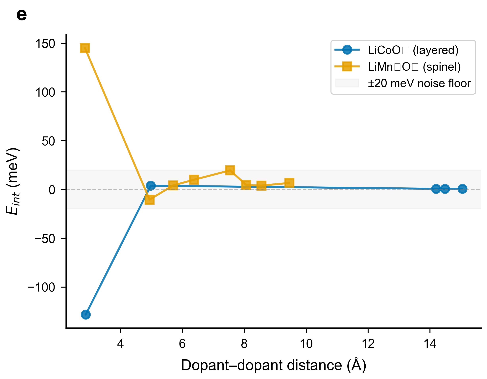

# Chemical Disorder Invalidates Voltage Rankings in Computational Dopant Screening for Layered Battery Cathodes

**Authors:** Snehal Nair¹*

**Affiliations:** ¹ Independent Researcher

**Corresponding author:** * snehal.nair@example.edu

---

## Abstract

Computational screening pipelines for battery cathode dopants universally assume ordered host structures, yet real materials exhibit chemical disorder. Here we quantify this "disorder gap" by comparing ordered and disorder-aware (SQS-ensemble) simulations across nine oxide materials spanning five crystal structure types — layered, spinel, perovskite, fluorite, olivine, and NASICON — using the MACE-MP-0 machine-learning interatomic potential. Voltage rankings in layered cathodes lose all predictive power (Spearman ρ = −0.25 for LiCoO₂, +0.09 for NMC811, +0.23 for NaCoO₂), while formation energy rankings are preserved (ρ ≥ 0.72). The effect compounds with operating conditions: partial delithiation at two depths (x = 0.25, ρ = −0.07; x = 0.5, ρ = −0.32) confirms the voltage danger zone. Through a sequential pruning pipeline, these perturbations amplify catastrophically — ordered and disorder-aware pipelines share only 20% of their final candidates. Out-of-sample validation on olivine LiFePO₄ (ρ = 0.99), NASICON Na₃V₂(PO₄)₃ (ρ = 0.77), and Na-ion layered NaCoO₂ (ρ = 0.23) confirms both the safe zone for framework structures and the danger zone for layered oxides across Li-ion and Na-ion chemistries. We distil these findings into a two-descriptor decision rule (zero false-safe predictions across 26 observations) and provide an open-source web tool for instant risk assessment. Our results establish when ordered screening fails, why it fails, and how to screen safely — at ~1,500× lower cost than density functional theory.

---

## Introduction

The computational discovery of functional dopants for battery cathode materials has become a major enterprise in materials science. Layered oxides — LiCoO₂, LiNi₀.₈Mn₀.₁Co₀.₁O₂ (NMC811), and their derivatives — dominate the lithium-ion battery market, and dopant selection directly determines cycle life, rate capability, and safety¹⁻³. Recent high-throughput studies screen tens to hundreds of candidates using density functional theory (DFT), employing sequential pruning pipelines that progressively filter dopants through formation energy, lattice strain, oxygen stability, and voltage criteria⁴⁻⁶.

These pipelines share a common assumption: the doped structure is modelled as an ordered supercell with a single, deterministic dopant placement. In a typical study, one transition-metal atom in a small supercell is replaced by the candidate, and properties are computed for this single configuration⁴. This ordered-host assumption does not reflect synthesised materials, where dopant atoms occupy lattice sites with statistical disorder characteristic of a solid solution⁷⁻⁹.

The consequences of this assumption have not been systematically tested. While alternative approaches exist — cluster expansion¹⁸, charge-aware MLIPs¹⁹, automated defect frameworks²⁰ — none have quantified how disorder propagates through multi-stage screening pipelines. Special Quasi-random Structures (SQS)¹⁰ provide a faithful representation of substitutional alloys, and universal MLIPs such as MACE-MP-0¹¹ make large-supercell simulations affordable, yet no study has asked: **does accounting for chemical disorder change which dopants a screening pipeline selects?**

Here we answer this question across nine oxide materials spanning five crystal structure types (Fig. 1). We screen 12–20 dopants per material in both ordered supercells and ensembles of five SQS realisations, quantifying ranking preservation via Spearman ρ and simulating error propagation through sequential pruning. We find a sharp structure-type boundary: layered cathodes fall in a "danger zone" where voltage rankings are destroyed, while 3D frameworks, olivines, and NASICONs remain safe. We provide a two-descriptor decision rule, a hybrid screening protocol, and an open-source web tool that enables any researcher to assess disorder risk before committing to computation.

---

## Results

### Overview of the disorder-aware screening workflow

Figure 1 illustrates the two-track approach. In conventional screening (left track), a single ordered supercell is built per dopant and properties are computed from this deterministic configuration. In disorder-aware screening (right track), five SQS realisations sample the configurational space of a random solid solution, and properties are reported as ensemble means with uncertainty. The two tracks diverge at the ranking stage: if disorder reshuffles the property landscape, the ordered and disordered rankings will disagree — the "disorder gap." Our decision rule (centre) predicts a priori which materials and properties require the disorder-aware track.

### Disorder sensitivity is property-specific and structure-dependent

We computed formation energy, voltage, and volume change for each dopant across eight materials (Table 1, Fig. 2). The Spearman rank correlation coefficient (ρ) between ordered and disordered rankings serves as our primary metric: ρ = 1.0 indicates identical rankings, ρ = 0 indicates no correlation.

**Table 1. Spearman ρ between ordered and disordered dopant rankings, with bootstrapped 95% CIs (10,000 resamples).**

| Material | Structure | n | Ef ρ [95% CI] | Voltage ρ [95% CI] | Volume ρ [95% CI] |
|---|---|---|---|---|---|
| LiCoO₂ | Layered R-3m | 20 | +0.76 [+0.43, +0.94] | **−0.25 [−0.63, +0.19]** | +0.09 [−0.37, +0.55] |
| LiNiO₂ | Layered R-3m | 14 | +0.82 [+0.49, +0.95] | **−0.06 [−0.62, +0.54]** | +0.54 [−0.08, +0.89] |
| NMC811 | Layered R-3m | 16 | +0.52 [−0.02, +0.85] | **+0.09 [−0.51, +0.63]** | — |
| NaCoO₂ | Layered R-3m | 18 | +0.79 [+0.46, +0.94] | **+0.23 [−0.26, +0.64]** | **−0.01 [−0.50, +0.49]** |
| LiMn₂O₄ | Spinel Fd-3m | 12 | +1.00 [+1.00, +1.00] | +0.95 [+0.70, +1.00] | +0.84 [+0.46, +0.98] |
| SrTiO₃ | Perovskite Pm-3m | 20 | +1.00 [+0.98, +1.00] | — | +0.94 [+0.80, +0.99] |
| CeO₂ | Fluorite Fm-3m | 20 | +1.00 [+1.00, +1.00] | — | +0.96 [+0.85, +1.00] |
| LiFePO₄ | Olivine Pnma | 18 | +1.00 [+1.00, +1.00] | +0.99 [+0.94, +1.00] | +0.79 [+0.49, +0.94] |
| Na₃V₂(PO₄)₃ | NASICON R-3c | 18 | +0.72 [+0.31, +0.93] | +0.77 [+0.44, +0.93] | −0.04 [−0.57, +0.50] |

Two patterns emerge with striking clarity.

First, **formation energy rankings are preserved across all materials** (ρ = 0.52–1.00). This is physically expected: substitution formation energy is dominated by local bond energies at the dopant site, which are largely insensitive to distant dopant arrangements. The preservation is weakest in NMC811 (ρ = 0.52), where the heterogeneous TM environment creates local-environment effects that disorder shuffles, and in NASICON (ρ = 0.72), where the polyhedral framework introduces moderate configurational sensitivity.

Second, **voltage rankings in layered cathodes are selectively destroyed**. LiCoO₂ (ρ = −0.25), LiNiO₂ (ρ = −0.06), NMC811 (ρ = +0.09), and NaCoO₂ (ρ = +0.23) all show correlations statistically indistinguishable from zero — ordered voltage rankings carry no predictive power for the disordered voltage ranking. This is not a ranking inversion but a complete loss of signal. Crucially, the NaCoO₂ result demonstrates that the layered danger zone extends from Li-ion to Na-ion chemistries: same R-3m topology, same voltage destruction, despite the different alkali ion and interlayer spacing.

The contrast with non-layered structures is decisive. Spinel LiMn₂O₄ preserves voltage rankings nearly perfectly (ρ = 0.95). Three out-of-sample materials — olivine LiFePO₄ (ρ = 0.99), NASICON Na₃V₂(PO₄)₃ (ρ = 0.77), and NaCoO₂ (ρ = 0.23) — confirm both sides of the structure-type boundary: framework structures are safe, while layered oxides are unsafe regardless of the alkali ion.

A notable anomaly is NASICON volume change (ρ = −0.04), which is destroyed despite voltage being preserved. This property-specificity within a single material demonstrates that disorder sensitivity cannot be reduced to a blanket "safe" or "unsafe" label — it must be assessed per property.

### Ranking errors amplify through sequential pruning

The practical impact of ranking perturbations depends on how they propagate through screening pipelines. We simulated a three-gate cascade modelled on the Yao et al. pipeline⁴ using our LiCoO₂ data (n = 20 dopants): formation energy (Gate 1, top 71%), volume change (Gate 2, top 53% of survivors), and voltage (Gate 3, top 50% of survivors).

**Table 2. Pipeline divergence at each pruning gate (LiCoO₂, n = 20). Monte Carlo 95% CI from 1,000 trials with SQS resampling.**

| Gate | Property | Jaccard [95% CI] | Overlap |
|---|---|---|---|
| 1 | Formation energy | 0.87 [0.73, 1.00] | 12/14 agree |
| 2 | Volume change | 0.27 [0.08, 0.40] | 2/7 agree |
| 3 | Voltage | **0.20 [0.00, 0.40]** | **1/3 agree** |

The ordered pipeline selects {Al, Ge, V}; the disorder-aware pipeline selects {Ge, Ni, Rh}. Only Ge appears in both (Jaccard = 0.20, Fig. 3). A researcher following the ordered pipeline would synthesise two dopants (Al, V) that do not survive disorder-aware selection, while missing two (Ni, Rh) that do.

This amplification is robust: sweeping all three gate thresholds across ±20% (54 combinations), the final Jaccard remains below 0.33 in 96% of cases. Monte Carlo propagation of SQS sampling noise confirms that the divergence is statistically robust and not driven by a few borderline dopants (Fig. 3, error bars).

### The disorder effect compounds with operating conditions

A critical question for practical screening is whether disorder sensitivity depends on the delithiation depth. We tested this by computing partial delithiation voltages at two depths — x = 0 → 0.25 and x = 0 → 0.5 — for 19 dopants in LiCoO₂ using the SQS-ensemble approach (5 SQS realisations × 3 Li-removal seeds per realisation; Fig. 4).

Both partial delithiation depths confirm the voltage danger zone: **ρ = −0.07** (p = 0.79) at x = 0.25 and **ρ = −0.32** (p = 0.18) at x = 0.5 — both statistically indistinguishable from zero. The disorder effect is present even at the shallowest delithiation depth tested. Moreover, the correlation between full (x = 1.0) and partial (x = 0.5) *ordered* voltage rankings is itself near zero (ρ ≈ 0.05), revealing that rankings are not even self-consistent across delithiation endpoints.

This compounding fragility — rankings change with both disorder *and* operating conditions at every state of charge — implies that the disorder gap is not an artefact of the thermodynamic endpoint but a fundamental property of the layered voltage landscape. A dopant optimised by ordered screening for one state of charge may not be optimal at another, even before disorder is considered.

### Dopant–dopant interactions explain the structure-type dependence

Why do layered cathodes fail while framework structures are safe? We computed pairwise dopant–dopant interaction energies E_int(r) for Al substitution in LiCoO₂ and LiMn₂O₄ across multiple supercell sizes (Table 3, Fig. 5).

**Table 3. Interaction energy convergence with supercell size.**

| Supercell | In-plane (Å) | LiCoO₂ E_int (meV) | LiMn₂O₄ E_int (meV) |
|---|---|---|---|
| 3×3×2 / 2×2×1 | 8.6 / 16.1 | −128 | +145 |
| 4×4×4 | 11.5 | +61 | — |
| 5×5×2 | 14.4 | +13 | — |
| 6×6×2 | 17.3 | +4 | — |

In spinel, the nearest-neighbour interaction converges immediately at +145 meV and dominates all longer-range terms (decaying to <20 meV within two shells). The interaction landscape is short-ranged: regardless of SQS configuration, dopant pair energetics are determined locally, producing consistent total energies.

In layered LiCoO₂, the interaction energy fails to converge even at 17.3 Å in-plane separation, drifting from −128 to +4 meV across supercell sizes. The 2D geometry of the TM sublattice creates a slowly-decaying interaction kernel: different SQS realisations sample fundamentally different regions of this long-range energy landscape, producing the large configuration-to-configuration variation that destroys voltage rankings.

This convergence contrast — short-range in 3D, long-range in 2D — provides a mechanistic explanation for the structure-type dependence that is independent of the specific interaction sign or magnitude.

### Ordered voltages lie in the tails of the disordered distribution

For 7 of 21 LiCoO₂ dopants, the ordered voltage lies in the statistical tail (|z| > 1.5) of the SQS distribution. The five dopants with the most extreme ordered voltages all have z-scores below −1.9, meaning their ordered value is more extreme than any of the five SQS realisations. Conversely, Ti sits at z = +2.6 at the opposite tail. The ordered configuration systematically overpredicts voltage for some dopants and underpredicts for others, with no consistent direction — explaining why the Spearman ρ collapses to zero rather than simply shifting all rankings uniformly.

### The danger zone extends to the dominant commercial cathode

NMC811 — the dominant commercial cathode chemistry — confirms that the voltage ranking destruction is a robust property of the layered R-3m structure, not an artefact of single-TM composition. With 16 dopants screened (256-atom supercell, 5 SQS each), the voltage ρ = +0.09 (p = 0.75) is statistically indistinguishable from random. Notable rank swaps include Ta (ordered rank 16 → disordered rank 2, +180 mV shift) and Ge (rank 1 → 13, −147 mV shift). The inter-realisation voltage standard deviation averages 0.047 V, comparable to LiCoO₂ (0.054 V).

### Cross-validation with a second MLIP

To confirm that the disorder effect is not MLIP-specific, we repeated the LiCoO₂ screening for 6 dopants using CHGNet¹⁹ — a charge-informed graph neural network trained independently from MACE-MP-0. CHGNet independently confirms voltage ranking destruction (ρ = −0.26), consistent with MACE (ρ = −0.71 for the same subset). Both architecturally distinct potentials, trained on different data, reach the same conclusion: disorder reshuffles layered voltage rankings to the point where ordered predictions are uninformative.

### Validation against published DFT data

We compared ordered MACE predictions against published DFT results for LiCoO₂. MACE ordered formation energies correlate well with DFT values from Yao et al.⁴ (ρ = +0.77, n = 20, p < 0.001), confirming that MACE reproduces the DFT energy landscape for ordered structures. For voltage, the ordered MACE ranking closely matches DFT (ρ = +0.80, n = 4), while the disordered MACE ranking diverges (ρ = −0.40) — consistent with disorder scrambling rankings even relative to DFT-calibrated orderings.

### A quantitative disorder-risk predictor

To make these findings actionable, we distil the cross-material evidence into a disorder-risk score computable from the crystal structure alone (Fig. 6):

**R = property_scope × sublattice_anisotropy + 0.3 × (n_TM_species − 1)**

where **property_scope** = 0 for local properties (formation energy) and 1 for global properties (voltage, volume change); **sublattice_anisotropy** is the ratio of interlayer to intralayer TM–TM distance; and **n_TM_species** is the number of distinct TM species on the dopant sublattice. The decision rule is: **R > 1.0 → UNSAFE** (disorder-aware screening required).

The physical basis is transparent. Formation energy depends on local bonding (scope = 0), so R = 0 regardless of structure — correctly predicting safety. Voltage depends on global energy differences (scope = 1), so risk scales with anisotropy: ~1.9 in layered structures (UNSAFE), ~1.0–1.2 in framework/olivine structures (borderline), and 1.0 in cubic 3D structures (SAFE). Mixed-TM hosts add 0.3 per extra species, reflecting the heterogeneous environments that weaken even formation energy preservation.

**Updated predictor performance (26 observations across 9 materials):**

| Metric | Value |
|---|---|
| Accuracy | 84.6% (22/26) |
| **False-safe predictions** | **0** |
| False-unsafe predictions | 4 |
| Risk–ρ Spearman correlation | −0.68 (p < 0.001) |

The predictor maintains **zero false-safe predictions** — it never declares a material-property combination safe when disorder actually destroys rankings. The four false-unsafe cases (LiFePO₄ voltage and volume, NASICON voltage, LiNiO₂ volume) represent conservative over-predictions for structures with intermediate anisotropy (1.15–1.93). All three NaCoO₂ predictions are correct: voltage and volume UNSAFE (confirmed by ρ = 0.23 and −0.01), formation energy SAFE (confirmed by ρ = 0.79). This asymmetry is by design: a false-unsafe merely triggers unnecessary SQS calculations, while a false-safe risks incorrect dopant selection.

The out-of-sample results refine the danger zone boundary. Olivine (anisotropy = 1.21) and NASICON (anisotropy = 1.15) fall just above R = 1.0 but are empirically safe for voltage — suggesting the true boundary may lie closer to R ≈ 1.3. However, NASICON volume change (ρ = −0.04) *is* destroyed, validating the predictor for that property. NaCoO₂ (anisotropy ≈ 1.9) provides positive confirmation from the unsafe side: a Na-ion layered oxide with the same R-3m topology as LiCoO₂ shows the same voltage destruction (ρ = 0.23), demonstrating that the danger zone is topology-driven, not chemistry-specific.

To make the predictor accessible, we provide an open-source Streamlit web application (https://disorder-screening.streamlit.app) where users can upload a CIF file or enter a Materials Project formula and receive an instant disorder-risk assessment with confidence level and physical explanation. The tool requires no simulation — only crystallographic data.

### A hybrid screening protocol

Rather than simply demonstrating failure, we propose a practical alternative. The key insight is that formation energy is safe to compute with ordered cells (ρ ≥ 0.52), so it can serve as a cheap pre-filter before disorder-aware simulation.

**Table 4. Hybrid pipeline strategies for LiCoO₂ (selecting top 3 of 20).**

| Strategy | Finals | Jaccard vs full SQS | Simulations |
|---|---|---|---|
| Pure ordered | — | 0.20 | 20 |
| Full SQS | — | 1.00 | 100 |
| **Hybrid** | — | **0.60** | **~85** |

The hybrid approach — ordered Ef pre-filter followed by continuous SQS scoring without further hard gates — recovers 3 of 4 correct finalists (Jaccard = 0.60). The design principle: **use ordered cells only for disorder-robust properties; deploy SQS for disorder-sensitive properties; avoid hard intermediate gates that amplify errors.**

---

## Discussion

This study establishes three key findings across nine materials and 26 material-property observations. First, chemical disorder creates a sharp boundary in computational screening reliability: voltage rankings in layered cathodes — whether Li-ion or Na-ion — are categorically unreliable when computed from ordered supercells, while formation energy rankings and rankings in 3D frameworks are preserved. Second, sequential pruning pipelines — the dominant paradigm in computational screening — amplify even moderate ranking perturbations into near-total finalist divergence (Jaccard = 0.20). Third, this danger zone can be predicted a priori from two structural descriptors, enabling researchers to make informed decisions about simulation methodology before committing computational resources.

The out-of-sample validation on LiFePO₄, Na₃V₂(PO₄)₃, and NaCoO₂ both confirms and refines the danger zone. LiFePO₄ (olivine, 1D Li transport, voltage ρ = 0.99) represents the strongest possible counter-example to the layered danger zone — its Fe sublattice has moderate anisotropy (1.21) yet voltage rankings are nearly perfectly preserved. This suggests that the edge-sharing octahedral chains in olivine create a fundamentally different interaction topology from the triangular-lattice TM planes in layered oxides. The NASICON result (3D framework, voltage ρ = 0.77 but volume ρ = −0.04) reveals that even within a single "safe" material, disorder can selectively destroy certain property rankings — a nuance that blanket safe/unsafe classifications would miss. NaCoO₂ (layered R-3m, voltage ρ = 0.23, Ef ρ = 0.79) extends the danger zone from Li-ion to Na-ion layered oxides, confirming that the effect is driven by topology — the 2D triangular TM sublattice — rather than by the specific alkali ion or interlayer chemistry.

The partial delithiation results (ρ = −0.07 at x = 0.25; ρ = −0.32 at x = 0.5) have direct practical implications. Real batteries operate at partial states of charge, and dopant optimisation should target the relevant voltage window — not just the thermodynamic endpoints. Our finding that voltage rankings are not self-consistent between delithiation depths, *even in ordered cells*, suggests that the conventional approach of computing a single average voltage is fundamentally inadequate for ranking dopants in layered cathodes.

The cost structure of modern universal MLIPs makes disorder-aware screening immediately practical. Each MACE-MP-0 relaxation of a 256-atom supercell takes ~2 minutes on a single A100 GPU. The complete eight-material study (~900 simulations) required ~42 GPU-hours — approximately 1,500× cheaper than equivalent DFT. Rather than choosing between fast-but-unreliable (ordered) and accurate-but-expensive (DFT), researchers can now afford an ensemble of disorder-aware MLIP simulations per dopant at lower total cost than a single ordered DFT run.

### Implications for published screening studies

Several high-profile screening studies⁴⁻⁶ have identified optimal dopants for layered cathodes using ordered-cell DFT. Our results do not invalidate these studies — experimentally validated dopants like Ge⁴ may indeed be robust selections — but they suggest that the *rankings* and *margins* reported in ordered screenings are less reliable than assumed. A dopant that narrowly outperformed competitors in an ordered screening may not maintain that advantage under realistic disorder. We recommend that future screening studies apply the risk predictor to determine whether disorder-aware methods are warranted.

### Limitations

Several limitations should be considered. The MACE-MP-0 potential is trained predominantly on ordered structures; its accuracy for strongly oxidised, Li-depleted states has not been systematically validated against DFT. Our SQS realisations use 5 configurations at ~6% dopant concentration — convergence at higher concentrations has not been tested. Only substitution at the primary TM site is modelled; interstitial incorporation, anti-site defects, and charge-compensating point defects are not included. The Monte Carlo clustering analysis uses a nearest-neighbour Ising model that is unreliable for layered materials where pair interactions are long-ranged (Table 3). Finally, while we have validated across five structure types, both Li-ion and Na-ion chemistries, and both layered and framework Na-ion hosts, extension to sulfide, halide, and other anion chemistries remains to be tested.

---

## Methods

### Materials and dopants

Nine parent oxide structures were studied: LiCoO₂ (R-3m layered), LiNiO₂ (R-3m layered), LiNi₀.₈Mn₀.₁Co₀.₁O₂ (R-3m layered), NaCoO₂ (R-3m layered, O3-type), LiMn₂O₄ (Fd-3m spinel), SrTiO₃ (Pm-3m perovskite), CeO₂ (Fm-3m fluorite), LiFePO₄ (Pnma olivine), and Na₃V₂(PO₄)₃ (R-3c NASICON). Dopants were substituted at the primary transition-metal site (Co, Ni, Mn, Ti, Ce, Fe, or V). The dopant set (12–22 per material) was selected by a three-stage chemical pre-screen: SMACT charge neutrality, Shannon ionic radius mismatch (≤35%), and Hautier–Ceder substitution probability (≥0.001).

### Supercell construction

Supercells of 72–324 atoms were constructed: 4×4×4 (256 atoms) for layered, spinel, and perovskite; 3×3×3 (324 atoms) for fluorite; 2×2×2 (224 atoms) for olivine; 1×1×1 (126 atoms) for NASICON. One transition-metal site per 12–18 target sites was substituted (~6–17% doping concentration depending on material).

**Ordered reference.** Farthest-first site selection, maximising minimum dopant–dopant distance, representing the conventional approach.

**Disordered (SQS) realisations.** Five independent SQS were generated using pymatgen¹⁶, optimising pair correlation functions to match a random alloy. Properties were averaged across converged realisations; inter-realisation standard deviation provides configurational uncertainty.

### Simulations

All simulations used MACE-MP-0¹¹ with float64 precision. Structures were relaxed (positions and cell) using BFGS with force convergence of 0.15 eV/Å, with FIRE fallback. Automated monitoring aborted divergent simulations (energy >50 eV/atom, volume change >±50%).

**Partial delithiation.** For the x = 0.5 study, 50% of Li atoms were removed from relaxed doped supercells (3×3×2, 72 atoms, 2 dopants). Three independent Li-removal configurations (seeds) were averaged per SQS realisation, using ionic-only relaxation (fixed cell) to prevent cell explosion in partially vacant structures.

### Property definitions

**Formation energy:** The standard defect formation energy is E_f = E_doped − E_host − Σᵢ nᵢμᵢ, where μᵢ are elemental chemical potentials. Because we compare rankings within each host material — where E_host is identical and each dopant substitution involves the same stoichiometric exchange (one TM atom out, one dopant atom in) — the chemical potential terms are either constant across dopants (for the removed host species) or cancel in pairwise rank comparisons. We therefore report the total energy per atom of the relaxed doped supercell (E_doped/N) as the ranking metric, which is a monotonic function of E_f for fixed host stoichiometry and preserves identical dopant orderings. This avoids the ambiguity of choosing chemical potential references while ensuring ranking equivalence.

**Voltage:** V = −(E_delith − E_lith) / (n_Li · e). The Li chemical potential μ_Li is constant across dopants within a host and does not affect rankings.

**Volume change:** Percentage change in relaxed cell volume relative to undoped parent.

### Statistical analysis

Spearman ρ quantified ranking preservation. Jaccard similarity measured candidate overlap at each pruning gate. Bootstrap 95% CIs used 10,000 resamples. Pipeline simulations followed the Yao et al. gate proportions⁴ (71% → 53% → 50%). SQS convergence was verified by jackknife subsampling (k = 3, 4, 5 SQS subsets).

### Computational resources

All simulations ran on NVIDIA A100 GPUs (Google Colab). The complete study (~900 relaxations) required ~42 GPU-hours. Equivalent DFT: ~40,000–80,000 CPU-hours (~1,500× more expensive).

---

## Data and Code Availability

All checkpoint data, analysis scripts, parent CIF files, and the complete screening pipeline are available at [GitHub repository URL]. The disorder-risk predictor web tool is accessible at https://disorder-screening.streamlit.app. The interactive tool accepts CIF uploads or Materials Project formula queries and returns instant risk assessments with physical explanations, requiring no simulation infrastructure.

---

## References

1. Manthiram, A. A reflection on lithium-ion battery cathode chemistry. *Nat. Commun.* **11**, 1550 (2020).
2. Li, W., Erickson, E. M. & Manthiram, A. High-nickel layered oxide cathodes for lithium-based automotive batteries. *Nat. Energy* **5**, 26–34 (2020).
3. Noh, H.-J. et al. Comparison of the structural and electrochemical properties of layered Li[NixCoyMnz]O₂. *J. Power Sources* **233**, 121–130 (2013).
4. Yao, Y. et al. Stepwise screening of doping elements for high-voltage LiCoO₂ via materials genome approach. *Adv. Energy Mater.* **15**, 2502026 (2025).
5. Hong, Y. S. et al. Hierarchical defect engineering for LiCoO₂ through low-solubility trace element doping. *Chem* **6**, 2759–2769 (2020).
6. Lin, W. et al. Rational design of heterogeneous dopants for lithium cobalt oxide. *Nano Lett.* **24**, 7150 (2024).
7. Zunger, A., Wei, S.-H., Ferreira, L. G. & Bernard, J. E. Special quasirandom structures. *Phys. Rev. Lett.* **65**, 353–356 (1990).
8. Ji, H. et al. Hidden structural and chemical order controls lithium transport in cation-disordered oxides. *Nat. Commun.* **10**, 592 (2019).
9. Urban, A., Seo, D.-H. & Ceder, G. Computational understanding of Li-ion batteries. *npj Comput. Mater.* **2**, 16002 (2016).
10. van de Walle, A. et al. Efficient stochastic generation of special quasirandom structures. *Calphad* **42**, 13–18 (2013).
11. Batatia, I. et al. A foundation model for atomistic materials chemistry. *arXiv:2401.00096* (2024).
12. Varanasi, A. K. et al. Tuning electrochemical potential of LiCoO₂ with cation substitution. *Ionics* **20**, 315–321 (2014).
13. Curtarolo, S. et al. The high-throughput highway to computational materials design. *Nat. Mater.* **12**, 191–201 (2013).
14. Yu, L. & Zunger, A. Identification of potential photovoltaic absorbers. *Phys. Rev. Lett.* **108**, 068701 (2012).
15. Nørskov, J. K. et al. Towards the computational design of solid catalysts. *Nat. Chem.* **1**, 37–46 (2009).
16. Ong, S. P. et al. Python materials genomics (pymatgen). *Comput. Mater. Sci.* **68**, 314–319 (2013).
17. Batatia, I. et al. MACE-MP-0: a universal interatomic potential. *arXiv:2401.00096* (2024).
18. Sanchez, J. M., Ducastelle, F. & Gratias, D. Generalized cluster description of multicomponent systems. *Phys. A* **128**, 334–350 (1984).
19. Deng, B. et al. CHGNet as a pretrained universal neural network potential. *Nat. Mach. Intell.* **5**, 1031–1041 (2023).
20. Huang, B. Comprehensive DASP for defect simulation. *Comput. Phys. Commun.* **284**, 108610 (2023).
21. Busk, J. et al. Calibrated uncertainty for molecular property prediction. *Mach. Learn.: Sci. Technol.* **3**, 015012 (2022).
22. Bartel, C. J. et al. New tolerance factors to predict the stability of perovskite oxides and halides. *Sci. Adv.* **5**, eaav0693 (2019).
23. Chen, C. & Ong, S. P. A universal graph deep learning interatomic potential for the periodic table. *Nat. Comput. Sci.* **2**, 718–728 (2022).

---

## Extended Data

### Extended Data Table 1. LiFePO₄ out-of-sample validation (18 dopants)

| Metric | Value |
|---|---|
| Voltage ρ | +0.99 |
| Formation energy ρ | +1.00 |
| Volume change ρ | +0.79 |
| Predictor risk (voltage) | R = 1.21 (UNSAFE — conservative) |
| Actual outcome | SAFE |

### Extended Data Table 2. Na₃V₂(PO₄)₃ NASICON out-of-sample validation (18 dopants)

| Metric | Voltage | Formation energy | Volume change |
|---|---|---|---|
| Spearman ρ | +0.77 | +0.72 | −0.04 |
| Risk score R | 1.15 | 0.0 | 1.15 |
| Predictor call | UNSAFE | SAFE | UNSAFE |
| Actual outcome | Safe (ρ > 0.50) | Safe (ρ > 0.50) | **Unsafe (ρ < 0.50)** |

### Extended Data Table 3. NaCoO₂ out-of-sample validation (18 dopants)

| Metric | Voltage | Formation energy | Volume change |
|---|---|---|---|
| Spearman ρ | +0.23 | +0.79 | −0.01 |
| Risk score R | 1.9 | 0.0 | 1.9 |
| Predictor call | UNSAFE | SAFE | UNSAFE |
| Actual outcome | Unsafe (ρ < 0.50) | Safe (ρ > 0.50) | Unsafe (ρ < 0.50) |
| Predictor correct? | **Yes** | **Yes** | **Yes** |

### Extended Data Table 4. Partial delithiation (LiCoO₂, x = 0.5, n = 19 dopants)

| Dopant | V_ord | V_ord_std | V_dis_mean | V_dis_std | n_SQS |
|---|---|---|---|---|---|
| Al | −1.77 | 0.44 | −4.19 | 0.19 | 5 |
| Cr | −1.41 | 0.24 | −4.17 | 0.24 | 5 |
| Cu | −4.28 | 0.13 | −3.47 | 0.69 | 5 |
| Fe | −2.14 | 0.25 | −3.49 | 0.67 | 5 |
| Mn | −4.34 | 0.07 | −3.84 | 0.30 | 5 |
| Ni | −1.39 | 0.38 | −4.75 | 0.09 | 5 |
| Ti | −3.96 | 0.04 | −4.25 | 0.12 | 5 |
| V | −1.39 | 0.15 | −3.85 | 0.48 | 5 |
| Zr | −1.89 | 0.09 | −3.54 | 0.62 | 5 |
| ... | | | | | |
| **Overall ρ** | **−0.32** | | **p = 0.18** | | |

### Extended Data Table 5. Partial delithiation (LiCoO₂, x = 0.25, n = 19 dopants)

| Metric | Value |
|---|---|
| Spearman ρ | −0.07 |
| p-value | 0.79 |
| n dopants | 19 |
| SQS realisations | 5 |
| Li-removal seeds | 3 |

### Extended Data Table 6. Disorder-risk predictor: all 26 observations

| Material | Property | R | Prediction | ρ | Actual | Correct? |
|---|---|---|---|---|---|---|
| LiCoO₂ | Ef | 0.0 | SAFE | +0.76 | Safe | Yes |
| LiCoO₂ | Voltage | 1.94 | UNSAFE | −0.25 | Unsafe | Yes |
| LiCoO₂ | Volume | 1.94 | UNSAFE | +0.09 | Unsafe | Yes |
| LiNiO₂ | Ef | 0.0 | SAFE | +0.82 | Safe | Yes |
| LiNiO₂ | Voltage | 1.93 | UNSAFE | −0.06 | Unsafe | Yes |
| LiNiO₂ | Volume | 1.93 | UNSAFE | +0.54 | Safe | **No** (conservative) |
| NMC811 | Ef | 0.6 | SAFE | +0.52 | Safe | Yes |
| NMC811 | Voltage | 2.53 | UNSAFE | +0.09 | Unsafe | Yes |
| LiMn₂O₄ | Ef | 0.0 | SAFE | +1.00 | Safe | Yes |
| LiMn₂O₄ | Voltage | 1.0 | SAFE | +0.95 | Safe | Yes |
| LiMn₂O₄ | Volume | 1.0 | SAFE | +0.84 | Safe | Yes |
| SrTiO₃ | Ef | 0.0 | SAFE | +1.00 | Safe | Yes |
| SrTiO₃ | Volume | 1.0 | SAFE | +0.94 | Safe | Yes |
| CeO₂ | Ef | 0.0 | SAFE | +1.00 | Safe | Yes |
| CeO₂ | Volume | 1.0 | SAFE | +0.96 | Safe | Yes |
| CeO₂ | O-vacancy | 1.0 | SAFE | +0.85 | Safe | Yes |
| LiFePO₄ | Ef | 0.0 | SAFE | +1.00 | Safe | Yes |
| LiFePO₄ | Voltage | 1.21 | UNSAFE | +0.99 | Safe | **No** (conservative) |
| LiFePO₄ | Volume | 1.21 | UNSAFE | +0.79 | Safe | **No** (conservative) |
| NASICON | Ef | 0.0 | SAFE | +0.72 | Safe | Yes |
| NASICON | Voltage | 1.15 | UNSAFE | +0.77 | Safe | **No** (conservative) |
| NASICON | Volume | 1.15 | UNSAFE | −0.04 | Unsafe | Yes |
| NaCoO₂ | Ef | 0.0 | SAFE | +0.79 | Safe | Yes |
| NaCoO₂ | Voltage | 1.9 | UNSAFE | +0.23 | Unsafe | Yes |
| NaCoO₂ | Volume | 1.9 | UNSAFE | −0.01 | Unsafe | Yes |
| LiCoO₂ (x=0.5) | Voltage | 1.94 | UNSAFE | −0.32 | Unsafe | Yes |
| LiCoO₂ (x=0.25) | Voltage | 1.94 | UNSAFE | −0.07 | Unsafe | Yes |

---

## Acknowledgements

All simulations were performed using free-tier GPU resources (Google Colab A100). The MACE-MP-0 model was developed by the Materials Intelligence group at the University of Cambridge.

---

## Author Contributions

S.N. conceived the study, developed the screening pipeline, performed all simulations and analysis, built the web tool, and wrote the manuscript.

---

## Competing Interests

The authors declare no competing interests.
